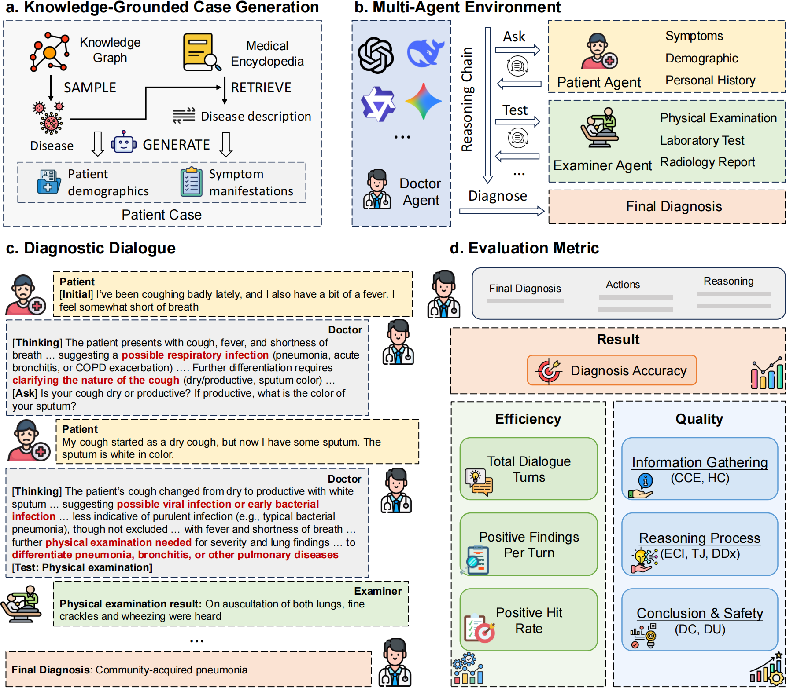

<div align="center">

<h1 align="center"> ClinMAS: A Knowledge-Grounded Multi-Agent Simulation Framework for Evaluating Clinical Reasoning in LLMs  </h1>

<div align=center></div>

<p></p>
</div>

**ClinMAS** is a dynamic framework for assessing clinical reasoning in large language models (LLMs) through simulated multi-turn doctor-patient diagnostic dialogues. Unlike existing evaluation paradigms primarily rely on static benchmarks, ClinMAS models diagnosis as an interactive process involving hypothesis generation, information gathering, test justification, and differential revision. By integrating disease knowledge graphs with a multi-agent dialogue environment, ClinMAS enables contamination-resistant case generation and process-aware evaluation across accuracy, efficiency, and reasoning quality. Its fine-grained, rubric-based assessment exposes clinically meaningful reasoning gaps in state-of-the-art LLMs, providing a robust and scalable paradigm for advancing reliable clinical AI evaluation.

<h3 id="3.1">🔧 Installation</h3>

Set up a conda environment:
```bash
conda create -n ClinMAS python=3.10.9
conda activate ClinMAS
```
Then, install the dependencies using pip:
```bash
pip install -r requirements.txt
```

<h3 id="3.2">🚀 Running Evaluations </h3>

**Step 1: API and Model Endpoint Setup**
1. Deploy your model as an OpenAI-compatible server.
2. **Configure API settings** in `request.py`.

**Step 2: Run Multi-Agent Simulation**
```bash
cd src
bash run.sh
```
`run.sh` iterates over different **Doctor Agents** and calls `interact.py` to simulate up to 15 turns. The interaction proceeds as follows:
- **Patient Agent (`patient.py`)** generates the initial chief complaint and subsequent answers.
- **Doctor Agent (`doctor.py`)** reads the evolving `chat_history` and produces **Thought + Action**; the dialogue terminates when `[!Diag!]` is output.
- **Examiner Agent (`assistant.py`)** returns formatted `[!Positive!]` / `[!Negative!]` examination results and counts findings.

**Step 3: Fine-Grained Quality Assessment**
```bash
cd ../eval
python quality_eval.py
```
`quality_eval.py` reads `result_<model>.jsonl` and uses LLM as judge to score 7 dimensions and a total score. Results are written to:
- `score/<model>_quality_evaluation_scored.jsonl`
- `score/<model>_quality_evaluation_failed.jsonl`
- `all_models_quality_summary.json` 

**Step 4: Patient-Side Binary Checks**
```bash
python patient_quality_eval.py
```
This script evaluates two boolean criteria: **Information Leakage** and **Clinical Fidelity**. It outputs:
- `patient_score/new/<model>_binary_eval.jsonl`
- `patient_score/new/<model>_binary_eval_failed.jsonl`
- `binary_evaluation_summary.json`

**Step 5: Retry Missing Quality Scores (Optional)**
```bash
python retry_quality_eval.py
```
When `score/<model>_quality_evaluation_scored.jsonl` has missing items, this script re-evaluates only the missing entries and appends successful results to the original file.

<h3 id="3.3">📜 Tips </h3>

1. **KG dataset format**: `source/data.jsonl` is the dataset constructed from knowledge graph (KG). Each line is a JSON object with at least:
   - `name`: disease name  
   - `desc`: case profile + disease description
2. **Dialogue result format**: `src/result_<model>.jsonl` stores per-case outputs:
   ```json
   {"name":"<disease>","final_answer":"<diagnosis>","turns":"<int>","positive_findings":"<int>","negative_findings":"int","chat_history":"<full dialogue text>"}
   ```
3. **Evaluation artifacts**:  
   - `eval/score/` contains 7-dimension scores.  
   - `eval/patient_score/new/` contains patient-side binary checks.  
   - Summary files: `all_models_quality_summary.json` and `binary_evaluation_summary.json`.
4. **Model access**: Set `OPENAI_API_BASE` / `OPENAI_API_KEY`, `DASHSCOPE_API_BASE` / `DASHSCOPE_API_KEY`, and `MODELSCOPE_API_BASE` / `MODELSCOPE_API_KEY` as needed (different models may use different API KEY providers).


